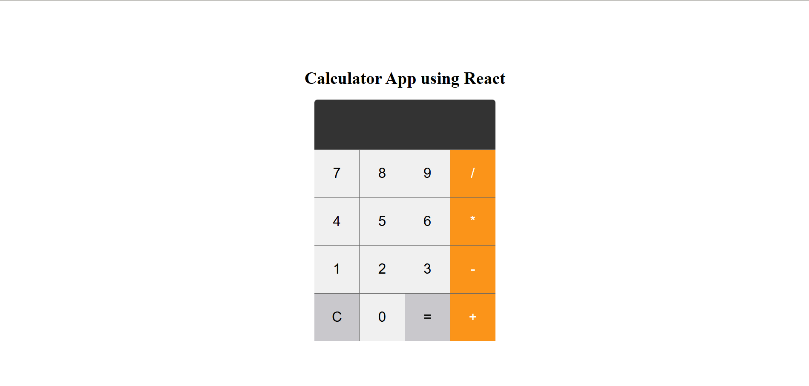

Here is the `README.md` file in **Markdown format** for your **React Calculator App**:

---

# 🧮 React Calculator App

A simple calculator built using **React.js** that supports basic arithmetic operations.

---

## 📌 Features

- Add, subtract, multiply, divide numbers
- Live input display
- Clear (`C`) button to reset input
- Uses **React Hooks** (`useState`) for state management
- Split into reusable `Keypad` component
- Simple and clean UI

---

## 📁 Project Structure
```

calculator-app/
├── App.js            # Main calculator component
├── keypad.js         # Keypad (buttons) component
├── App.css           # Styling file (customize as needed)
├── index.js          # Entry point
├── package.json      # Dependencies and scripts
└── README.md         # Project documentation

````

---

## 🚀 Getting Started

Follow these steps to run the calculator locally:

### 1. Prerequisites

- Node.js and npm installed  
  📥 [Download Node.js](https://nodejs.org/)

---

### 2. Installation

```bash
npx create-react-app calculator-app
cd calculator-app
````

🔁 Replace the contents of:

* `App.js` with your provided code
* `keypad.js` with the Keypad component
* Optionally, style using `App.css`

---

### 3. Run the App

```bash
npm start
```

Your app will be live at:
📍 `http://localhost:3000`

---

## ⚠️ Warning

> ⚠️ This app uses `eval()` to evaluate expressions, which is generally **not safe** for production use.
> For a secure and production-ready calculator, consider using a math expression parser like:

```bash
npm install mathjs
```

And replace:

```js
let ans = eval(input)
```

with:

```js
import { evaluate } from 'mathjs';
let ans = evaluate(input);
```

---

## 🎨 Example Screenshot



---

## 🛠️ Future Improvements

* Add decimal support
* Input validation
* Keyboard support
* Scientific calculator mode
* Secure expression parsing

---

## 👨‍💻 Author

**Mithilesh Konagalla**
📅 July 2025

---

## 📄 License

This project is open-source and free to use.

